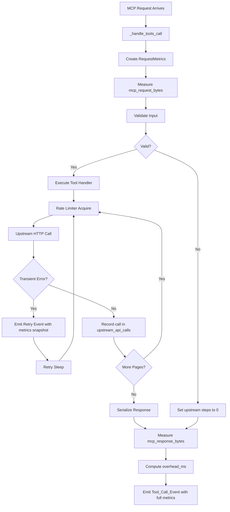

# Design Document: Enhanced Request Logging

## Overview

This design enhances the Fellow MCP Server's request logging to provide structured timing breakdowns, request/response size metrics, and upstream API response codes on all request-related log events. The current flat `duration_ms` field on `tool_call` events is replaced with a nested `timings` object that decomposes total request duration into discrete, additive steps. Size metrics and status codes are added to support operational troubleshooting.

The design introduces a `RequestMetrics` collector that accumulates timing, size, and status data as a request flows through the handler pipeline. This collector is threaded through the existing components (validator, rate limiter, API client, paginator) via a context object, and its final state is emitted on the `tool_call` INFO log event. Intermediate state is emitted on retry WARNING events.

### Design Decisions

1. **Collector pattern over middleware**: A `RequestMetrics` dataclass is passed through the call chain rather than using Flask middleware or thread-locals. This keeps metrics collection explicit, testable, and free of hidden state.
2. **Instrumented wrappers over monkey-patching**: Rather than patching `time.time` or modifying library internals, we wrap calls to the rate limiter, validator, and API client with timing code at the call site.
3. **Overhead step for sum invariant**: To guarantee the additive invariant (sum of steps == total_ms), an `overhead_ms` step absorbs any unaccounted framework time (context switching, Python interpreter overhead, etc.).
4. **Omit-not-null strategy**: Fields that aren't applicable (e.g., `upstream_status_code` when no upstream call is made) are omitted from the log event entirely, rather than set to null or 0. This simplifies log queries and avoids ambiguity.

## Architecture



## Components and Interfaces

### RequestMetrics (New Dataclass)

Location: `app/logging/metrics.py`

```python
@dataclass
class UpstreamCallRecord:
    """Record of a single upstream API call."""
    page: int
    duration_ms: float
    status_code: int
    request_bytes: int
    response_bytes: int

@dataclass
class RequestMetrics:
    """Accumulates timing and size metrics throughout a request lifecycle."""
    
    # Wall-clock start
    start_time: float
    
    # Step durations (milliseconds, rounded to 2dp)
    validation_ms: float = 0.0
    rate_limiter_wait_ms: float = 0.0
    upstream_api_ms: float = 0.0
    retry_wait_ms: float = 0.0
    serialization_ms: float = 0.0
    overhead_ms: float = 0.0
    
    # Size metrics (bytes)
    mcp_request_bytes: int = 0
    mcp_response_bytes: int = 0
    upstream_request_bytes: int = 0
    upstream_response_bytes: int = 0
    
    # Status tracking
    upstream_status_code: Optional[int] = None
    
    # Per-call detail
    upstream_api_calls: list[UpstreamCallRecord] = field(default_factory=list)
    
    def compute_total_ms(self) -> float:
        """Compute total elapsed time from start to now."""
        return round((time.time() - self.start_time) * 1000, 2)
    
    def compute_overhead_ms(self) -> float:
        """Compute overhead as total minus sum of known steps."""
        total = self.compute_total_ms()
        known = (self.validation_ms + self.rate_limiter_wait_ms +
                 self.upstream_api_ms + self.retry_wait_ms +
                 self.serialization_ms)
        return round(max(0.0, total - known), 2)
    
    def build_timings_dict(self) -> dict:
        """Build the timings object for log emission."""
        self.overhead_ms = self.compute_overhead_ms()
        total_ms = self.compute_total_ms()
        return {
            "total_ms": total_ms,
            "steps": {
                "validation_ms": self.validation_ms,
                "rate_limiter_wait_ms": self.rate_limiter_wait_ms,
                "upstream_api_ms": self.upstream_api_ms,
                "retry_wait_ms": self.retry_wait_ms,
                "serialization_ms": self.serialization_ms,
                "overhead_ms": self.overhead_ms,
            }
        }
    
    def build_retry_timings_dict(self) -> dict:
        """Build timings object for retry events (total_elapsed_ms only)."""
        return {"total_elapsed_ms": self.compute_total_ms()}
```

### InstrumentedRateLimiter (Wrapper)

Location: `app/client/rate_limiter.py` (extend existing)

A thin wrapper or modification to `TokenBucketRateLimiter.acquire()` that returns the time spent waiting. Alternatively, the caller measures the time around `acquire()`.

**Decision**: The caller measures time around `acquire()` to avoid modifying the rate limiter's clean interface. This keeps the rate limiter reusable and testable independently.

### InstrumentedApiClient (Modified)

Location: `app/client/fellow_api.py` (modify existing)

The `_do_request_with_retry` method is modified to:
1. Measure rate limiter wait time per attempt
2. Measure HTTP round-trip time per attempt
3. Record request/response byte sizes per attempt
4. Capture status codes per attempt
5. Accumulate retry wait time from tenacity's sleep duration
6. Emit API_Call_Event at DEBUG level for each HTTP call
7. Emit Retry_Event with cumulative metrics snapshot on each retry

The method accepts a `RequestMetrics` instance (or accumulates into one internally and exposes it).

**Decision**: The `_request` method accepts an optional `RequestMetrics` parameter. When provided, it accumulates metrics into it. When not provided (e.g., `health_check`), no metrics are collected. This avoids breaking the existing interface.

### Modified _handle_tools_call

Location: `app/main.py` (modify existing)

The function is restructured to:
1. Record `mcp_request_bytes` from `request.get_data()`
2. Time the validation step
3. Pass `RequestMetrics` to the API client
4. Time the response serialization step
5. Record `mcp_response_bytes`
6. Compute `overhead_ms` and emit the final `Tool_Call_Event`

## Data Models

### Tool_Call_Event Structure (INFO level)

```json
{
  "event": "tool_call",
  "tool": "list_action_items",
  "outcome": "success",
  "timings": {
    "total_ms": 245.67,
    "steps": {
      "validation_ms": 0.12,
      "rate_limiter_wait_ms": 50.33,
      "upstream_api_ms": 180.45,
      "retry_wait_ms": 0.00,
      "serialization_ms": 1.23,
      "overhead_ms": 13.54
    }
  },
  "mcp_request_bytes": 256,
  "mcp_response_bytes": 4096,
  "upstream_request_bytes": 128,
  "upstream_response_bytes": 3800,
  "upstream_status_code": 200,
  "upstream_api_calls": [
    {"page": 1, "duration_ms": 95.20, "status_code": 200, "request_bytes": 64, "response_bytes": 2000},
    {"page": 2, "duration_ms": 85.25, "status_code": 200, "request_bytes": 64, "response_bytes": 1800}
  ]
}
```

### Retry_Event Structure (WARNING level)

```json
{
  "event": "fellow_api_retry",
  "attempt": 2,
  "wait_seconds": 1.5,
  "reason": "HTTP 429: Rate limited",
  "status_code": 429,
  "timings": {
    "total_elapsed_ms": 1250.33
  },
  "mcp_request_bytes": 256,
  "upstream_request_bytes": 128,
  "upstream_response_bytes": 45,
  "upstream_api_calls": [
    {"page": 1, "duration_ms": 120.50, "status_code": 429, "request_bytes": 128, "response_bytes": 45}
  ]
}
```

### API_Call_Event Structure (DEBUG level)

```json
{
  "event": "fellow_api_call",
  "http_method": "POST",
  "url": "https://workspace.fellow.app/api/v1/action_items",
  "duration_ms": 95.20,
  "status_code": 200,
  "request_bytes": 64,
  "response_bytes": 2000
}
```

### Field Presence Rules

| Field | Tool_Call_Event | Retry_Event | API_Call_Event |
|-------|:-:|:-:|:-:|
| `timings` (full with steps) | ✓ | — | — |
| `timings` (total_elapsed_ms only) | — | ✓ | — |
| `mcp_request_bytes` | ✓ | ✓ | — |
| `mcp_response_bytes` | ✓ | — | — |
| `upstream_request_bytes` | ✓ | ✓ | — |
| `upstream_response_bytes` | ✓ | ✓ | — |
| `upstream_status_code` | ✓* | — | — |
| `status_code` | — | ✓ | ✓ |
| `upstream_api_calls` | ✓ | ✓ | — |
| `duration_ms` | — | — | ✓ |
| `request_bytes` | — | — | ✓ |
| `response_bytes` | — | — | ✓ |

*`upstream_status_code` omitted when no upstream call is made.

## Correctness Properties

*A property is a characteristic or behavior that should hold true across all valid executions of a system — essentially, a formal statement about what the system should do. Properties serve as the bridge between human-readable specifications and machine-verifiable correctness guarantees.*

### Property 1: Timing Sum Invariant

*For any* `tools/call` request that completes (successfully or with error), the sum of all values in `timings.steps` SHALL equal `timings.total_ms` within a tolerance of 1 millisecond.

**Validates: Requirements 1.3**

### Property 2: Step Duration Validity

*For any* `tools/call` request, all numeric values within `timings.steps` SHALL be non-negative floats rounded to exactly two decimal places, and `timings.total_ms` SHALL be a non-negative float rounded to exactly two decimal places.

**Validates: Requirements 1.2, 1.5, 1.6, 1.7, 1.8, 1.9, 1.10**

### Property 3: Zero Steps on Early Exit

*For any* `tools/call` request that completes without making an upstream API call (e.g., validation failure, unknown tool), the `timings.steps` fields `upstream_api_ms`, `retry_wait_ms`, and `serialization_ms` SHALL be 0, and `upstream_request_bytes` and `upstream_response_bytes` SHALL be 0.

**Validates: Requirements 1.4, 2.9**

### Property 4: MCP Request Bytes Round-Trip

*For any* `tools/call` request with a JSON-RPC body of N bytes, the Tool_Call_Event field `mcp_request_bytes` SHALL equal N (the byte length of the raw incoming request body).

**Validates: Requirements 2.1, 2.5**

### Property 5: MCP Response Bytes Round-Trip

*For any* `tools/call` request, the Tool_Call_Event field `mcp_response_bytes` SHALL equal the byte length of the UTF-8 encoded JSON response body actually returned to the client.

**Validates: Requirements 2.2, 2.6**

### Property 6: Upstream Bytes Accumulation

*For any* `tools/call` request, `upstream_request_bytes` SHALL equal the sum of `request_bytes` across all entries in `upstream_api_calls`, and `upstream_response_bytes` SHALL equal the sum of `response_bytes` across all entries in `upstream_api_calls`.

**Validates: Requirements 2.3, 2.4, 2.7, 2.8**

### Property 7: Upstream API Calls Timing Consistency

*For any* `tools/call` request that makes upstream API calls, `timings.steps.upstream_api_ms` SHALL equal the sum of `duration_ms` values across all entries in `upstream_api_calls`, within a tolerance of 0.01 milliseconds (rounding).

**Validates: Requirements 4.4**

### Property 8: Upstream Status Code Presence

*For any* `tools/call` request that makes at least one upstream API call, the Tool_Call_Event SHALL contain `upstream_status_code` as an integer. *For any* `tools/call` request that makes zero upstream API calls, the Tool_Call_Event SHALL NOT contain the `upstream_status_code` field.

**Validates: Requirements 3.1, 3.2, 3.6**

### Property 9: Event Field Partitioning

*For any* request processing that emits log events, the API_Call_Event SHALL contain only per-call fields (`duration_ms`, `status_code`, `request_bytes`, `response_bytes`) and SHALL NOT contain cumulative metrics. The Retry_Event SHALL NOT contain `mcp_response_bytes`. The Tool_Call_Event SHALL contain `mcp_response_bytes`.

**Validates: Requirements 6.1, 6.2, 6.3**

### Property 10: Exception Resilience

*For any* `tools/call` request that terminates due to an unhandled exception, the Tool_Call_Event SHALL still include a valid `timings` field where all step values are non-negative, remaining unmeasured steps are 0, and the sum invariant holds.

**Validates: Requirements 1.11**

## Error Handling

### Metric Collection Failures

If metric collection itself fails (e.g., `time.time()` raises, which is extremely unlikely), the handler MUST NOT propagate the failure to the client. The metrics code is wrapped in a try/except that:
1. Logs a warning about the metric collection failure
2. Falls back to emitting the Tool_Call_Event without the `timings` field (degraded but not broken)
3. Still returns the tool result to the client

### Upstream Call Tracking on Failure

When an upstream API call fails (timeout, network error, HTTP error):
- The call is still recorded in `upstream_api_calls` with the measured duration up to failure
- `status_code` is set to the received HTTP status or 0 if no response was received (e.g., timeout)
- `request_bytes` reflects bytes actually sent; `response_bytes` reflects bytes actually received

### Retry Event Emission Failures

If emitting a Retry_Event fails, the retry logic MUST NOT be affected. The retry/backoff mechanism takes precedence over logging. Failures in log emission are silently ignored to preserve reliability.

## Testing Strategy

### Property-Based Tests (Hypothesis)

Property-based testing is appropriate for this feature because:
- The metrics code produces structured output from varied inputs (tool names, argument sizes, response sizes, error conditions)
- Universal invariants hold across all inputs (timing sum, byte count consistency, field presence)
- Input variation reveals edge cases (empty bodies, large payloads, multi-page responses, exception paths)

**Library**: Hypothesis 6.92.1 (already in project)

**Configuration**: Minimum 100 iterations per property test.

**Tag format**: `Feature: enhanced-request-logging, Property {N}: {property_text}`

Each correctness property above maps to one property-based test. Tests will:
- Generate random tool call scenarios (valid/invalid arguments, varied response sizes, pagination depths, error conditions)
- Execute through the actual handler or a focused unit under test
- Capture structlog output and verify the invariant holds

### Unit Tests

Unit tests complement property tests for:
- Specific example scenarios (exact timing values with mocked time)
- Edge cases: empty request body, 0-byte response, max pagination depth
- Error conditions: exception at each pipeline stage
- Integration between `RequestMetrics` and the handler pipeline

### Integration Tests

- End-to-end test through the Flask test client verifying log events contain all expected fields
- Verify `mcp_request_bytes` matches actual request size
- Verify `mcp_response_bytes` matches actual response size
