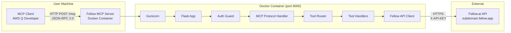
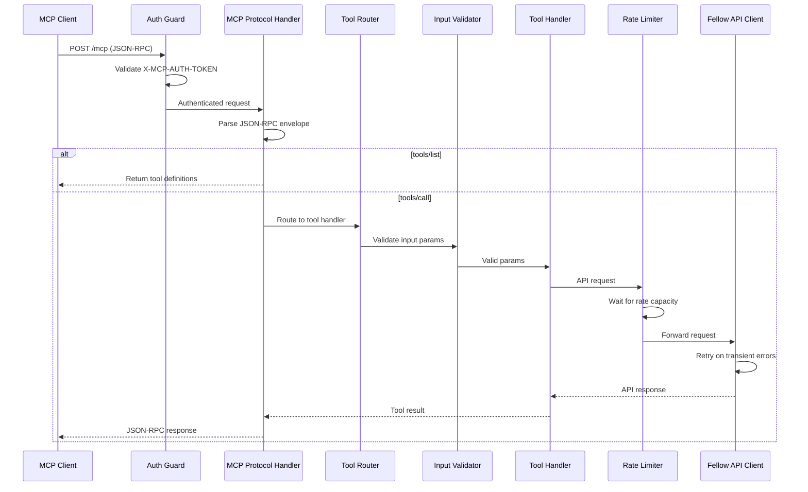
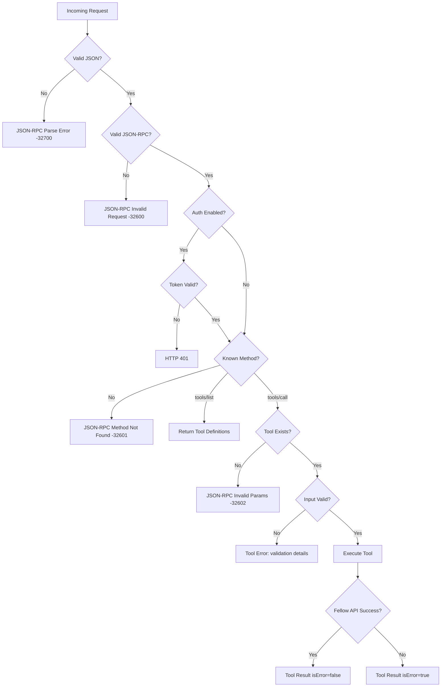

# Design Document: Fellow MCP Server

## Overview

This document describes the technical design for a custom MCP (Model Context Protocol) server that bridges AWS Q Developer (or any MCP-compatible client) to the Fellow.ai Developer API. The server runs as a Docker container, accepting JSON-RPC 2.0 messages over HTTP and translating them into Fellow.ai REST API requests.

The design prioritizes reliability, clear error handling, and operational observability. It uses a layered architecture separating transport concerns (HTTP/MCP protocol), business logic (tool routing, validation), and external communication (Fellow.ai API client with retry/rate-limiting).

### Key Design Decisions

1. **Synchronous request model**: Flask + Gunicorn with sync workers. The Fellow.ai API rate limit (3 req/s) means concurrency is naturally bounded. Async adds complexity without meaningful throughput gain.
2. **Eager pagination**: The server fetches all pages transparently before responding. This simplifies the MCP client interaction at the cost of higher latency for large result sets, bounded by a 20-page cap.
3. **Custom header auth over OAuth**: The `X-MCP-AUTH-TOKEN` mechanism is simpler to configure for local network deployments and avoids Fellow.ai's OAuth token refresh complexity.
4. **JSON-RPC 2.0 compliance**: All MCP messages follow the JSON-RPC 2.0 spec. The server handles `tools/list` and `tools/call` methods, returning protocol-level errors for malformed requests and tool-level errors for execution failures.

## Architecture

### High-Level System Diagram



### Request Flow Diagram



### Layered Architecture

```
┌─────────────────────────────────────────────────┐
│  Transport Layer (Flask + Gunicorn)              │
│  - HTTP endpoint, content-type handling          │
│  - Request ID generation, structured logging     │
├─────────────────────────────────────────────────┤
│  Security Layer (Auth Guard)                     │
│  - X-MCP-AUTH-TOKEN validation                   │
│  - Constant-time comparison                      │
├─────────────────────────────────────────────────┤
│  Protocol Layer (MCP Handler)                    │
│  - JSON-RPC 2.0 parsing & validation            │
│  - Method dispatch (tools/list, tools/call)      │
│  - Error response formatting                     │
├─────────────────────────────────────────────────┤
│  Business Logic Layer                            │
│  - Tool Router (name → handler mapping)          │
│  - Input Validator (jsonschema-based)            │
│  - Tool Handlers (per-resource logic)            │
├─────────────────────────────────────────────────┤
│  API Client Layer                                │
│  - Rate Limiter (token bucket, 3 req/s)          │
│  - Retry Handler (tenacity, exponential backoff) │
│  - Cursor Paginator (auto-fetch all pages)       │
│  - HTTP Client (requests, 30s timeout)           │
└─────────────────────────────────────────────────┘
```

## Components and Interfaces

### Project Structure

```
fellow-mcp/
├── app/
│   ├── __init__.py
│   ├── main.py                  # Gunicorn entry point, app factory
│   ├── config.py                # Configuration dataclass, env validation
│   ├── auth/
│   │   ├── __init__.py
│   │   └── guard.py             # Auth middleware
│   ├── mcp/
│   │   ├── __init__.py
│   │   ├── protocol.py          # JSON-RPC parsing, MCP message handling
│   │   ├── errors.py            # MCP/JSON-RPC error codes and builders
│   │   └── registry.py          # Tool definitions registry
│   ├── tools/
│   │   ├── __init__.py
│   │   ├── action_items.py      # Action item tool handlers
│   │   ├── notes.py             # Notes tool handlers
│   │   ├── recordings.py        # Recordings tool handlers
│   │   ├── webhooks.py          # Webhook tool handlers
│   │   └── user.py              # User info tool handler
│   ├── validation/
│   │   ├── __init__.py
│   │   └── schemas.py           # JSON schemas for tool inputs
│   ├── client/
│   │   ├── __init__.py
│   │   ├── fellow_api.py        # Fellow.ai HTTP client
│   │   ├── rate_limiter.py      # Token bucket rate limiter
│   │   └── paginator.py         # Cursor-based pagination
│   └── logging/
│       ├── __init__.py
│       └── setup.py             # structlog configuration
├── tests/
│   ├── conftest.py
│   ├── unit/
│   │   ├── test_auth.py
│   │   ├── test_protocol.py
│   │   ├── test_validation.py
│   │   ├── test_rate_limiter.py
│   │   ├── test_paginator.py
│   │   └── test_tools/
│   ├── integration/
│   │   └── test_mcp_endpoint.py
│   └── property/
│       ├── test_validation_properties.py
│       └── test_pagination_properties.py
├── Dockerfile
├── docker-compose.yml
├── requirements.txt
├── requirements-dev.txt
├── gunicorn.conf.py
└── .env.example
```

### Component Interfaces

#### 1. Configuration (`app/config.py`)

```python
from dataclasses import dataclass
from typing import Optional


@dataclass(frozen=True)
class AppConfig:
    """Immutable application configuration loaded from environment variables."""
    fellow_api_key: str
    fellow_subdomain: str
    mcp_auth_enabled: bool
    mcp_auth_token: Optional[str]
    gunicorn_workers: int
    log_level: str
    mcp_endpoint_path: str  # default: "/mcp"
    fellow_base_url: str    # derived: https://{subdomain}.fellow.app

    @classmethod
    def from_env(cls) -> "AppConfig":
        """Load and validate configuration from environment variables.

        Raises:
            SystemExit: If required variables are missing or invalid.
        """
        ...
```

#### 2. Auth Guard (`app/auth/guard.py`)

```python
from flask import Request, Response
from typing import Optional, Callable
from app.config import AppConfig


class AuthGuard:
    """Middleware that validates X-MCP-AUTH-TOKEN header."""

    def __init__(self, config: AppConfig) -> None: ...

    def check_request(self, request: Request) -> Optional[Response]:
        """Validate auth header. Returns None if authorized, error Response if not.

        Uses hmac.compare_digest for constant-time comparison.
        """
        ...
```

#### 3. MCP Protocol Handler (`app/mcp/protocol.py`)

```python
from typing import Any


def parse_jsonrpc_request(data: bytes) -> dict[str, Any]:
    """Parse raw bytes into a validated JSON-RPC 2.0 request.

    Raises:
        JsonRpcParseError: If JSON is malformed.
        JsonRpcInvalidRequest: If required JSON-RPC fields are missing.
    """
    ...


def build_tool_result(request_id: Any, content: list[dict], is_error: bool = False) -> dict:
    """Build a tools/call success or error result in MCP format."""
    ...


def build_tools_list_response(request_id: Any, tools: list[dict]) -> dict:
    """Build a tools/list response with all tool definitions."""
    ...


def build_jsonrpc_error(request_id: Any, code: int, message: str) -> dict:
    """Build a JSON-RPC 2.0 error response."""
    ...
```

#### 4. Tool Router (`app/mcp/registry.py`)

```python
from typing import Callable, Any


class ToolRegistry:
    """Maps tool names to handler functions and stores tool definitions."""

    def __init__(self) -> None:
        self._tools: dict[str, dict] = {}         # name -> definition
        self._handlers: dict[str, Callable] = {}  # name -> handler func

    def register(self, name: str, description: str,
                 input_schema: dict, handler: Callable) -> None:
        """Register a tool with its definition and handler."""
        ...

    def get_handler(self, name: str) -> Callable:
        """Get handler for a tool name. Raises ToolNotFoundError if unknown."""
        ...

    def list_tools(self) -> list[dict]:
        """Return all tool definitions for tools/list response."""
        ...
```

#### 5. Fellow API Client (`app/client/fellow_api.py`)

```python
from typing import Any, Optional
from app.config import AppConfig


class FellowApiClient:
    """HTTP client for Fellow.ai API with retry and rate limiting."""

    def __init__(self, config: AppConfig) -> None: ...

    def get(self, path: str, params: Optional[dict] = None) -> dict[str, Any]:
        """Send GET request to Fellow API.

        Handles: rate limiting, retries, Retry-After, timeouts.
        Raises FellowApiError on non-transient failure after retries.
        """
        ...

    def post(self, path: str, body: Optional[dict] = None) -> dict[str, Any]:
        """Send POST request to Fellow API."""
        ...

    def put(self, path: str, body: dict) -> dict[str, Any]:
        """Send PUT request to Fellow API."""
        ...

    def delete(self, path: str) -> dict[str, Any]:
        """Send DELETE request to Fellow API."""
        ...

    def health_check(self) -> bool:
        """Check if Fellow API is reachable. Returns True/False."""
        ...
```

#### 6. Rate Limiter (`app/client/rate_limiter.py`)

```python
import threading
import time


class TokenBucketRateLimiter:
    """Thread-safe token bucket rate limiter.

    Enforces max_requests_per_second by blocking callers until
    a token is available.
    """

    def __init__(self, max_per_second: float = 3.0) -> None:
        self._max_tokens: float = max_per_second
        self._tokens: float = max_per_second
        self._last_refill: float = time.monotonic()
        self._lock: threading.Lock = threading.Lock()

    def acquire(self) -> None:
        """Block until a token is available, then consume one."""
        ...
```

#### 7. Cursor Paginator (`app/client/paginator.py`)

```python
from typing import Any, Callable


class CursorPaginator:
    """Handles cursor-based pagination for Fellow API list endpoints.

    Fetches all pages sequentially, combining results into a single list.
    Stops when cursor is null or max_pages reached.
    """

    def __init__(self, max_pages: int = 20, page_size: int = 50) -> None: ...

    def fetch_all(
        self,
        request_fn: Callable[[dict], dict[str, Any]],
        base_params: dict
    ) -> tuple[list[dict], bool]:
        """Fetch all pages. Returns (combined_results, was_truncated).

        Args:
            request_fn: Function that takes params dict and returns API response.
            base_params: Base request parameters (filters, etc).

        Returns:
            Tuple of (all_results, truncated_flag).

        Raises:
            PaginationError: If a request fails mid-pagination (includes page number).
        """
        ...
```

#### 8. Input Validator (`app/validation/schemas.py`)

```python
from typing import Any


class InputValidator:
    """Validates tool call arguments against JSON schemas.

    Uses jsonschema for schema validation plus custom validators for
    business rules (date formats, enum values, ID constraints).
    """

    def validate(self, tool_name: str, arguments: dict[str, Any]) -> list[str]:
        """Validate arguments for a tool. Returns list of error messages (empty = valid).

        Collects ALL validation errors rather than failing on first.
        Ignores unrecognized parameters.
        """
        ...
```

## Data Models

### Configuration Environment Variables

| Variable | Required | Default | Validation |
|----------|----------|---------|------------|
| `FELLOW_API_KEY` | Yes | — | Non-empty string |
| `FELLOW_SUBDOMAIN` | Yes | — | Non-empty string |
| `MCP_AUTH_ENABLED` | No | `"false"` | Case-sensitive `"true"` enables auth |
| `MCP_AUTH_TOKEN` | Conditional | — | Min 16 chars when auth enabled |
| `GUNICORN_WORKERS` | No | `2` | Integer 1–8 |
| `LOG_LEVEL` | No | `"INFO"` | DEBUG, INFO, WARNING, ERROR, CRITICAL |
| `MCP_ENDPOINT_PATH` | No | `"/mcp"` | Valid URL path |

### MCP Protocol Messages

#### JSON-RPC Request (incoming)

```json
{
  "jsonrpc": "2.0",
  "id": 1,
  "method": "tools/list" | "tools/call",
  "params": {
    "name": "tool_name",        // tools/call only
    "arguments": { ... }        // tools/call only
  }
}
```

#### JSON-RPC Success Response (tools/call)

```json
{
  "jsonrpc": "2.0",
  "id": 1,
  "result": {
    "content": [
      { "type": "text", "text": "..." }
    ],
    "isError": false
  }
}
```

#### JSON-RPC Tool Execution Error

```json
{
  "jsonrpc": "2.0",
  "id": 1,
  "result": {
    "content": [
      { "type": "text", "text": "Error: <description>" }
    ],
    "isError": true
  }
}
```

#### JSON-RPC Protocol Error

```json
{
  "jsonrpc": "2.0",
  "id": 1,
  "error": {
    "code": -32602,
    "message": "Unknown tool: invalid_name"
  }
}
```

### Tool Definitions

Each tool is defined with a name, description, and JSON Schema for inputs. The complete list:

| Tool Name | Fellow API Endpoint | Method |
|-----------|-------------------|--------|
| `list_action_items` | `POST /api/v1/action_items` | POST |
| `get_action_item` | `GET /api/v1/action_item/{id}` | GET |
| `complete_action_item` | `POST /api/v1/action_item/{id}/complete` | POST |
| `archive_action_item` | `POST /api/v1/action_item/{id}/archive` | POST |
| `list_notes` | `POST /api/v1/notes` | POST |
| `get_note` | `GET /api/v1/note/{id}` | GET |
| `delete_note` | `DELETE /api/v1/note/{id}` | DELETE |
| `list_recordings` | `POST /api/v1/recordings` | POST |
| `get_recording` | `GET /api/v1/recording/{id}` | GET |
| `delete_recording` | `DELETE /api/v1/recording/{id}` | DELETE |
| `list_webhooks` | `GET /api/v1/webhook` | GET |
| `get_webhook` | `GET /api/v1/webhook/{id}` | GET |
| `create_webhook` | `POST /api/v1/webhook` | POST |
| `update_webhook` | `PUT /api/v1/webhook/{id}` | PUT |
| `delete_webhook` | `DELETE /api/v1/webhook/{id}` | DELETE |
| `get_current_user` | `GET /api/v1/me` | GET |

### Fellow API Response Structures

#### Paginated Response (list endpoints)

```json
{
  "results": [ ... ],
  "cursor": "next-page-cursor-string" | null
}
```

#### Action Item

```json
{
  "id": "string",
  "title": "string",
  "completed": true | false,
  "archived": true | false,
  "ai_detected": true | false,
  "due_date": "YYYY-MM-DD" | null,
  "created_at": "ISO 8601",
  "updated_at": "ISO 8601"
}
```

#### Note

```json
{
  "id": "string",
  "title": "string",
  "event_guid": "string" | null,
  "created_at": "ISO 8601",
  "updated_at": "ISO 8601",
  "content_markdown": "string",
  "event_attendees": [ ... ]
}
```

#### Recording

```json
{
  "id": "string",
  "title": "string",
  "event_guid": "string" | null,
  "created_at": "ISO 8601",
  "updated_at": "ISO 8601",
  "transcript": "string",
  "ai_notes": "string",
  "media_url": "string" | null
}
```

#### Webhook

```json
{
  "id": "string",
  "url": "string",
  "description": "string",
  "status": "active" | "inactive",
  "enabled_events": ["string"],
  "created_at": "ISO 8601"
}
```

### Health Endpoint Response

```json
{
  "status": "healthy",
  "fellow_api": "reachable" | "unreachable"
}
```

### Internal Error Types

```python
class FellowApiError(Exception):
    """Raised when Fellow API returns a non-transient error after retries."""
    def __init__(self, status_code: int, message: str): ...

class PaginationError(Exception):
    """Raised when a page fetch fails mid-pagination."""
    def __init__(self, page_number: int, cause: Exception): ...

class ToolNotFoundError(Exception):
    """Raised when tools/call references an unknown tool name."""
    def __init__(self, tool_name: str): ...

class ValidationError(Exception):
    """Raised when input validation fails."""
    def __init__(self, errors: list[str]): ...
```

## Correctness Properties

*A property is a characteristic or behavior that should hold true across all valid executions of a system—essentially, a formal statement about what the system should do. Properties serve as the bridge between human-readable specifications and machine-verifiable correctness guarantees.*


### Property 1: Malformed input always produces valid JSON-RPC error

*For any* byte sequence that is not valid JSON, or any JSON object missing required JSON-RPC 2.0 fields (`jsonrpc`, `method`), or any `tools/call` request referencing a tool name not in the registered set, the server SHALL return a well-formed JSON-RPC 2.0 error response with an appropriate error code and non-empty message.

**Validates: Requirements 1.3, 1.6**

### Property 2: Auth guard correctness

*For any* request and any authentication configuration, the Auth Guard SHALL allow the request if and only if: authentication is disabled (MCP_AUTH_ENABLED is not case-sensitively "true") OR the `X-MCP-AUTH-TOKEN` header value exactly equals the configured `MCP_AUTH_TOKEN`. All other cases SHALL result in HTTP 401.

**Validates: Requirements 2.1, 2.3, 2.4**


### Property 3: Configuration validation rejects invalid startup state

*For any* set of environment variable values, the server SHALL refuse to start if and only if: any required variable (`FELLOW_API_KEY`, `FELLOW_SUBDOMAIN`) is missing/empty, OR `MCP_AUTH_TOKEN` is empty/shorter than 16 characters while auth is enabled, OR `GUNICORN_WORKERS` is not an integer in [1, 8]. The startup error message SHALL identify the specific misconfiguration.

**Validates: Requirements 2.5, 2.6, 3.7, 3.8**

### Property 4: Input validation reports all errors simultaneously

*For any* tool call with N validation failures (missing required params, invalid types, invalid formats, out-of-range values, invalid enum values), the MCP error response SHALL contain exactly N error descriptions identifying each failing parameter and reason. Unrecognized parameters SHALL be silently ignored and not count as errors.

**Validates: Requirements 11.1, 11.2, 11.6, 11.7, 11.8**


### Property 5: ID and string constraint validation

*For any* string provided as a resource ID (action item, note, recording, webhook), validation SHALL pass if and only if the string length is between 1 and 255 inclusive. *For any* string provided as a webhook URL, validation SHALL pass if and only if the string length is between 1 and 2048 inclusive. *For any* string provided as a date filter, validation SHALL pass if and only if it matches the pattern `YYYY-MM-DD` with valid date components.

**Validates: Requirements 11.3, 11.4, 8.8**

### Property 6: Enum validation rejects invalid values and lists allowed values

*For any* tool parameter with enumerated allowed values (scope, ordering, enabled_events, note includes, recording includes), if the provided value is not in the allowed set, the error response SHALL list all allowed values for that parameter. If the value IS in the allowed set, validation SHALL pass.

**Validates: Requirements 6.6, 7.6, 8.6, 8.7, 11.6**


### Property 7: Filter parameters pass through to Fellow API requests

*For any* valid combination of filter parameters for list tools (action items, notes, recordings), the request sent to the Fellow API SHALL contain exactly those filter values in the request body, with no omissions and no additions beyond pagination parameters.

**Validates: Requirements 5.1, 6.1, 7.1**

### Property 8: Retry logic on transient errors

*For any* Fellow API request that fails with a transient HTTP status code (429, 500, 502, 503, 504), the client SHALL retry up to 3 times. If a `Retry-After` header is present on a 429 response with a valid positive integer value, that value SHALL be used as the delay instead of the calculated exponential backoff. After retries are exhausted, the MCP error response SHALL contain the HTTP status code and error message.

**Validates: Requirements 4.3, 4.4, 4.8**


### Property 9: Rate limiter enforces 3 requests per second

*For any* sequence of N requests submitted simultaneously where N > 3, the total elapsed time to complete all requests SHALL be at least (N - 3) / 3 seconds, ensuring no more than 3 requests per second reach the Fellow API.

**Validates: Requirements 4.5**

### Property 10: Pagination combines results in order and terminates correctly

*For any* sequence of Fellow API paginated responses where pages 1 through K-1 have non-null cursors and page K has a null cursor (or K equals the max page limit of 20), the paginator SHALL: (a) make exactly K requests, (b) return results as the ordered concatenation of all pages (first page first, last page last), (c) include a truncation indicator if and only if stopped by page limit rather than null cursor.

**Validates: Requirements 12.1, 12.2, 12.4, 12.5**


### Property 11: Mid-pagination failure discards partial results

*For any* pagination sequence where page K fails (K > 1, after K-1 successful pages), the paginator SHALL discard all previously retrieved results and return an error indicating which page number failed.

**Validates: Requirements 12.6**

### Property 12: Request ID correlates all log entries

*For any* request processed by the server, all structlog entries emitted during that request SHALL contain the same `request_id` field value, and that value SHALL be unique across concurrent requests.

**Validates: Requirements 10.7**


## Error Handling

### Error Classification

The server distinguishes between three error categories:

| Category | Scope | HTTP Status | MCP Response Format |
|----------|-------|-------------|---------------------|
| **Transport/Protocol** | Malformed JSON, missing JSON-RPC fields | 200 (JSON-RPC error in body) | `{"error": {"code": ..., "message": ...}}` |
| **Authentication** | Missing/invalid token | 401 | JSON body with error message (not JSON-RPC) |
| **Tool Execution** | Validation failures, API errors, timeouts | 200 | `{"result": {"content": [...], "isError": true}}` |

### JSON-RPC Error Codes

| Code | Meaning | Trigger |
|------|---------|---------|
| -32700 | Parse error | Invalid JSON |
| -32600 | Invalid request | Missing JSON-RPC required fields |
| -32601 | Method not found | Unknown method (not tools/list or tools/call) |
| -32602 | Invalid params | Unknown tool name, validation failures |
| -32603 | Internal error | Unexpected server errors |


### Error Flow



### Retry Strategy

```
Attempt 1: Immediate request
  → Transient failure (429/5xx) → wait 1s (or Retry-After)
Attempt 2: Retry
  → Transient failure → wait 2s (or Retry-After)
Attempt 3: Retry
  → Transient failure → wait 4s (or Retry-After)
Attempt 4: Final retry
  → Failure → Return MCP error with status code and message
```


### Graceful Degradation

- **Fellow API unreachable**: Health endpoint reports "unreachable" but server stays up. Tool calls return clear error.
- **Rate limit hit**: Requests queue behind the token bucket. No requests are dropped—they wait for capacity.
- **Pagination failure**: Partial results are discarded entirely. The client receives a clean error with the failed page number rather than incomplete data.

## Testing Strategy

### Test Framework and Libraries

- **pytest 7.4.3**: Test runner with fixtures and markers
- **hypothesis 6.92.1**: Property-based testing library
- **pytest-flask 1.3.0**: Flask test client integration
- **pytest-mock 3.12.0**: Mocking support
- **responses** or **requests-mock**: HTTP request mocking for Fellow API calls

### Test Categories

#### Unit Tests (pytest markers: `@pytest.mark.unit`)
- Individual component tests for auth guard, protocol parser, validators, rate limiter, paginator
- Mock all external dependencies
- Focus on specific examples, edge cases, and error conditions
- Cover: happy paths, boundary values, error states


#### Property-Based Tests (pytest markers: `@pytest.mark.property`)
- Minimum 100 iterations per property test
- Each test references its design document property via tag comment
- Tag format: `# Feature: fellow-mcp-server, Property N: <title>`
- Uses Hypothesis strategies to generate:
  - Random byte sequences and malformed JSON (Property 1)
  - Random token strings and auth configurations (Property 2)
  - Random env var combinations (Property 3)
  - Random tool arguments with various validation failures (Properties 4, 5, 6)
  - Random filter parameter combinations (Property 7)
  - Random HTTP status codes and Retry-After values (Property 8)
  - Timed request sequences (Property 9)
  - Random paginated response sequences (Properties 10, 11)

#### Integration Tests (pytest markers: `@pytest.mark.integration`)
- End-to-end tests through the Flask test client
- Mock only the Fellow.ai API (using responses library)
- Test complete request flows: auth → parse → validate → execute → respond
- Cover: full tool call lifecycle, health endpoint, error propagation

### Test Organization

```
tests/
├── conftest.py              # Shared fixtures (app, client, mock configs)
├── unit/
│   ├── test_auth.py         # Auth guard unit tests
│   ├── test_protocol.py     # JSON-RPC parsing unit tests
│   ├── test_validation.py   # Input validation unit tests
│   ├── test_rate_limiter.py # Rate limiter unit tests
│   ├── test_paginator.py    # Cursor paginator unit tests
│   ├── test_config.py       # Config loading/validation unit tests
│   └── test_tools/          # Individual tool handler tests
├── integration/
│   └── test_mcp_endpoint.py # Full endpoint integration tests
└── property/
    ├── test_protocol_properties.py    # Properties 1
    ├── test_auth_properties.py        # Property 2
    ├── test_config_properties.py      # Property 3
    ├── test_validation_properties.py  # Properties 4, 5, 6
    ├── test_filter_properties.py      # Property 7
    ├── test_retry_properties.py       # Property 8
    ├── test_rate_limiter_properties.py # Property 9
    └── test_pagination_properties.py  # Properties 10, 11
```


### Key Hypothesis Strategies

```python
# Example strategies for property tests
from hypothesis import strategies as st

# Random JSON-RPC-like payloads missing required fields
malformed_jsonrpc = st.fixed_dictionaries({
    "jsonrpc": st.just("2.0") | st.text(),
}).filter(lambda d: "method" not in d or "jsonrpc" not in d)

# Random tokens (any printable string)
random_tokens = st.text(min_size=0, max_size=100)

# Random filter combinations for action items
action_item_filters = st.fixed_dictionaries({}, optional={
    "completed": st.booleans(),
    "archived": st.booleans(),
    "ai_detected": st.booleans(),
    "scope": st.sampled_from(["assigned_to_me", "assigned_to_others", "all"]),
    "ordering": st.sampled_from(["created_at_desc", "created_at_asc", "due_date"]),
})

# Random paginated response sequences
paginated_responses = st.integers(min_value=1, max_value=25).flatmap(
    lambda n: st.lists(
        st.lists(st.dictionaries(st.text(), st.text()), min_size=0, max_size=50),
        min_size=n, max_size=n
    )
)
```

### Running Tests

```bash
# All tests (within venv)
source venv/bin/activate
pytest

# By category
pytest -m unit
pytest -m property
pytest -m integration

# With coverage
pytest --cov=app --cov-report=term-missing

# Property tests with verbose output
pytest -m property -v --hypothesis-show-statistics
```
